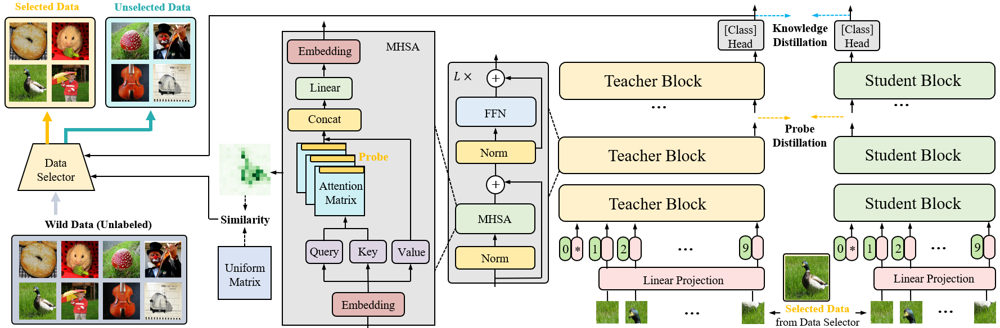
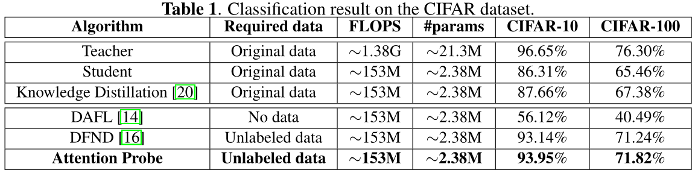

# Attention Probe: Vision Transformer Distillation in the Wild
[](https://opensource.org/licenses/MIT)

Jiahao Wang, Mingdeng Cao, Shuwei Shi, Baoyuan Wu, Yujiu Yang    
In ICASSP 2022

This code is the Pytorch implementation of ICASSP 2022 paper Attention Probe: Vision Transformer Distillation in the Wild

## Overview 
* We propose the concept of **Attention Probe**, a special section of the attention map to utilize a large amount of unlabeled data in the wild to complete the vision transformer data-free distillation task. Instead of generating images from the teacher network with a series of priori, images most relevant to the given pre-trained network and tasks will be identified from a large unlabeled dataset (e.g., Flickr) to conduct the knowledge distillation task.
* We propose a simple yet efficient distillation algorithm, called **probe distillation**, to distill the student model using intermediate features of the teacher model, which is based on the Attention Probe. 

<p align="center">

</p>

## Prerequisite
We use Pytorch 1.7.1, and CUDA 11.0. You can install them with  
~~~
pip install torch==1.7.1+cu110 torchvision==0.8.2+cu110 torchaudio==0.7.2 -f https://download.pytorch.org/whl/torch_stable.html
~~~   
It should also be applicable to other Pytorch and CUDA versions.  

## Usage 


### Data Preparation

First, you need to modify the storage format of the cifar-10/100 and tinyimagenet dataset to the style of ImageNet, etc.
CIFAR 10 run:
~~~
python process_cifar10.py
~~~
CIFAR 100 run:
~~~
python process_cifar100.py
~~~
Tiny-ImageNet run:
~~~
python process_tinyimagenet.py
python process_move_file.py
~~~

The dataset dir should have the following structure:
```
dir/
  train/
    ...
  val/
    n01440764/
      ILSVRC2012_val_00000293.JPEG
      ...
    ...
```


### Train a normal teacher network  

For this step you need to train normal teacher transformer models for selecting valuable data from the wild. We train the teacher model based on the timm PyTorch library:

[timm](https://github.com/rwightman/pytorch-image-models) 

Our pretrained teacher models (CIFAR-10, CIFAR-100, ImageNet, Tiny-ImageNet, MNIST) can be downloaded from here:

[Pretrained teacher models](https://drive.google.com/drive/folders/1f9tSJjy92iKsyDHxH3d4BjWAQciufn8r?usp=sharing) 


### Select valuable data from the wild

Then, you can use the Attention Probe method to select valuable data in the wild dataset.

To select valuable data
CIFAR-10 run:
```shell 
bash training.sh
(CUDA_VISIBLE_DEVICES=0 python DFND_DeiT-train.py --dataset cifar10 --data_cifar $root_cifar10 --data_imagenet $root_wild --num_select 650000 --teacher_dir $teacher_cifar10 --selected_file $selected_cifar10 --output_dir $output_student_cifar10 --nb_classes 10 --lr_S 7.5e-4 --attnprobe_sel --attnprobe_dist )
```

CIFAR-100 run:
```shell 
bash training.sh
(CIFAR 100 run: CUDA_VISIBLE_DEVICES=0 python DFND_DeiT-train.py --dataset cifar10 --data_cifar $root_cifar10 --data_imagenet $root_wild --num_select 650000 --teacher_dir $teacher_cifar10 --selected_file $selected_cifar10 --output_dir $output_student_cifar10 --nb_classes 10 --lr_S 7.5e-4 --attnprobe_sel --attnprobe_dist )
```

TinyImageNet run:
```shell 
bash training_tinyimagenet.sh
```

ImageNet run:
```shell 
bash training_imagenet.sh
```

After you will get "class_weights.pth, pred_out.pth, value_blk3.pth, value_blk7.pth, value_out.pth" in '/selected/cifar10/' or '/selected/cifar100/' directory, you have already obtained the selected data.


### Probe Knowledge Distillation for Student networks 

Then you can distill the student model using intermediate features of the teacher model based on the selected data. 
```shell 
bash training.sh
(CIFAR 10 run: CUDA_VISIBLE_DEVICES=0 python DFND_DeiT-train.py --dataset cifar100 --data_cifar $root_cifar100 --data_imagenet $root_wild --num_select 650000 --teacher_dir $teacher_cifar100 --selected_file $selected_cifar100 --output_dir $output_student_cifar100 --nb_classes 100 --lr_S 8.5e-4 --attnprobe_sel --attnprobe_dist)

(CIFAR 100 run: CUDA_VISIBLE_DEVICES=0,1,2,3 python DFND_DeiT-train.py --dataset cifar100 --data_cifar $root_cifar100 --data_imagenet $root_wild --num_select 650000 --teacher_dir $teacher_cifar100 --selected_file $selected_cifar100 --output_dir $output_student_cifar100 --nb_classes 100 --lr_S 8.5e-4 --attnprobe_sel --attnprobe_dist)
```

TinyImageNet run:
```shell 
bash training_tinyimagenet.sh
```

ImageNet run:
```shell 
bash training_imagenet.sh
```
you will get the student transformer model in '/output/cifar10/student/' or '/output/cifar100/student/' directory. 


Our distilled student models (CIFAR-10, CIFAR-100, ImageNet, Tiny-ImageNet, MNIST) can be downloaded from here:
[Distilled student models](https://drive.google.com/drive/folders/1aA7Pw3CwsUj4bD6pj05o56PCBRmAaQTh?usp=sharing) 


### Results

</p>


## Citation
~~~
@inproceedings{
wang2022attention,
title={Attention Probe: Vision Transformer Distillation in the Wild},
author={Jiahao Wang, Mingdeng Cao, Shuwei Shi, Baoyuan Wu, Yujiu Yang},
booktitle={International Conference on Acoustics, Speech and Signal Processing},
year={2022},
url={https://2022.ieeeicassp.org/}
}
~~~


## Acknowledgement
* [DFND](https://github.com/huawei-noah/Efficient-Computing/tree/master/Data-Efficient-Model-Compression/DFND)
* [Teacher-free KD](https://github.com/yuanli2333/Teacher-free-Knowledge-Distillation)
* [DAFL](https://github.com/huawei-noah/Data-Efficient-Model-Compression/tree/master/DAFL) 
* [DeepInversion](https://github.com/NVlabs/DeepInversion)

